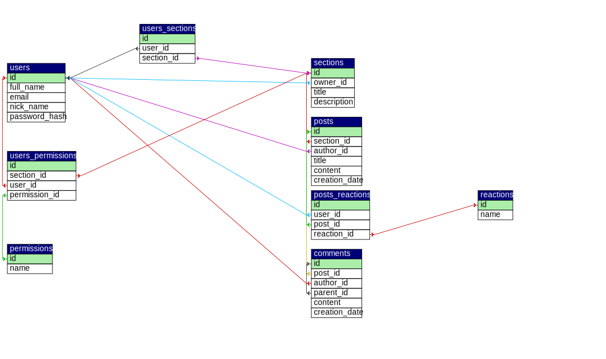

# [osoblive](http://osoblive.42web.io/)

Welcome to Osoblive, a social media platform inspired by the popular website Reddit. On this platform, users can create and join groups (called "subgroups") centered around specific topics, and post and comment on threads within those subgroups.


## Requirements (not strict)
- PHP 7.4.3 or higher
- MySQL 8.0.31-0ubuntu0.20.04.2

### Installing

1. Clone this repository
```sh
git clone https://github.com/matiduda/osoblive
cd osoblive
```

2. Set up an Apache server with MySQL, there are a bunch of ways but I found [this tutorial](https://www.digitalocean.com/community/tutorials/how-to-install-mysql-on-ubuntu-20-04) helpful

3. Import the database schema from `database/schema.sql`

4. Set up a PHP server and run it with the files in this directory.

## Database schema



## Version History

* 0.1
    * Initial Release

## License

This project is licensed under the MIT License - see the LICENSE.md file for details